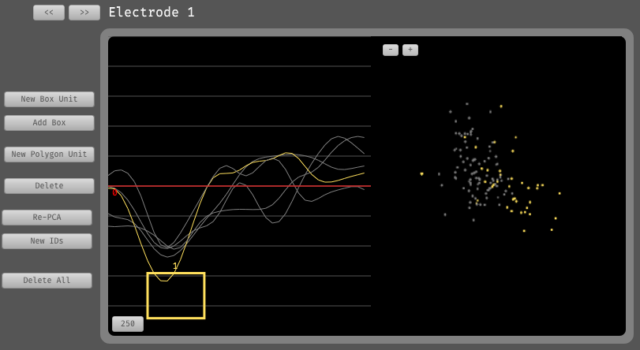

## Spike Sorter



Sorts spikes based on manually drawn boxes in waveform space, or boundaries in PCA space. Must be used in combination with a plugin that generates spikes, such as the Spike Detector.


## Installation

This plugin can be added via the Open Ephys GUI Plugin Installer. To access the Plugin Installer, press **ctrl-P** or **⌘P** from inside the GUI. Once the installer is loaded, browse to the "Spike Sorter" plugin and click "Install."

**Important:** Version 0.2.0 requires GUI v0.6.4 or higher.

## Usage

Instructions for using the Spike Sorter plugin are available [here](https://open-ephys.github.io/gui-docs/User-Manual/Plugins/Spike-Sorter.html).

## Building from source

First, follow the instructions on [this page](https://open-ephys.github.io/gui-docs/Developer-Guide/Compiling-the-GUI.html) to build the Open Ephys GUI.

**Important:** This plugin is intended for use with the latest version of the GUI (0.6.0 and higher). The GUI should be compiled from the [`main`](https://github.com/open-ephys/plugin-gui/tree/main) branch, rather than the former `master` branch.

Then, clone this repository into a directory at the same level as the `plugin-GUI`, e.g.:
 
```
Code
├── plugin-GUI
│   ├── Build
│   ├── Source
│   └── ...
├── OEPlugins
│   └── spike-sorter
│       ├── Build
│       ├── Source
│       └── ...
```

### Windows

**Requirements:** [Visual Studio](https://visualstudio.microsoft.com/) and [CMake](https://cmake.org/install/)

From the `Build` directory, enter:

```bash
cmake -G "Visual Studio 17 2022" -A x64 ..
```

Next, launch Visual Studio and open the `OE_PLUGIN_spike-sorter.sln` file that was just created. Select the appropriate configuration (Debug/Release) and build the solution.

Selecting the `INSTALL` project and manually building it will copy the `.dll` and any other required files into the GUI's `plugins` directory. The next time you launch the GUI from Visual Studio, the Spike Sorter plugin should be available.


### Linux

**Requirements:** [CMake](https://cmake.org/install/)

From the `Build` directory, enter:

```bash
cmake -G "Unix Makefiles" ..
cd Debug
make -j
make install
```

This will build the plugin and copy the `.so` file into the GUI's `plugins` directory. The next time you launch the compiled version of the GUI, the Spike Sorter plugin should be available.


### macOS

**Requirements:** [Xcode](https://developer.apple.com/xcode/) and [CMake](https://cmake.org/install/)

From the `Build` directory, enter:

```bash
cmake -G "Xcode" ..
```

Next, launch Xcode and open the `spike-sorter.xcodeproj` file that now lives in the “Build” directory.

Running the `ALL_BUILD` scheme will compile the plugin; running the `INSTALL` scheme will install the `.bundle` file to `/Users/<username>/Library/Application Support/open-ephys/plugins-api`. The Spike Sorter plugin should be available the next time you launch the GUI from Xcode.

## Attribution

This plugin was originally developed by Shay Ohayon in Doris Tsao's lab at Caltech. It is now being maintained by the Allen Institute.
